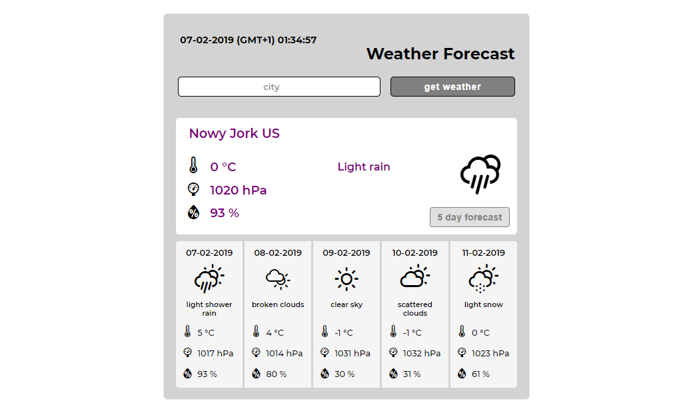

# Weather Forecast

### Link:
[https://szymtur.github.io/weather-forecast](https://szymtur.github.io/weather-forecast)

### Description:
Application used to check the current weather in the selected location

Forward geocoding is the process of converting a city name or place name into correct address with its latitude and longitude values.

IP Geolocation is the identification of the geographic location of a device, by using an IP address.

### Services used:
- IP Geolocation: ipapi.co
- Forward Geocoding: openstreetmap.org
- Weather forecast: weatherbit.io
- Timezone: timezonedb.com

### Technologies used:
- HTML5
- CSS3
- FlexBox
- RWD Media Queries
- JavaScript
- React.js

### Tools used:
- Webpack
